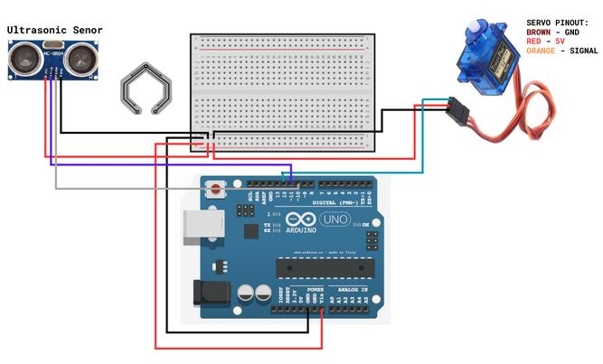

<h1 align="center">🛰️ Arduino Ultrasonic Radar System</h1>

  <strong>A real-time environment mapping system using Time-of-Flight (ToF) sensing.</strong>

  
  
  

---

## 📝 Description
An Arduino-based Radar System utilizing an <b>HC-SR04 Ultrasonic Sensor</b> and <b>SG90 Servo</b> to map surroundings. It features real-time visual data processing and distance calculation, rendered via the Processing IDE to simulate a classic sonar display.

## 🛠️ Hardware Requirements
* **Microcontroller:** Arduino Uno
* **Sensor:** HC-SR04 Ultrasonic Sensor
* **Actuator:** SG90 Servo Motor
* **Jumper Wires & Breadboard**

## 🔌 Circuit Connection
Refer to the diagram below for the wiring setup:

  

---

## 🚀 How to Run

### 1. Hardware Setup
Connect the components according to the circuit diagram provided above.

### 2. Arduino Configuration
* Open `radar_sys.ino` in your **Arduino IDE**.
* Select your board (Arduino Uno) and the correct COM port.
* Click **Upload**.

### 3. Visualization (Processing)
* Open the Processing IDE.
* Copy the code from the `processing_radarrr` folder.
* **Important:** Ensure the Serial Monitor in the Arduino IDE is closed.
* Click **Run** in Processing to view the radar sweep.

---

  <i>Developed as a 2nd Year CSE Mini-Project</i>

